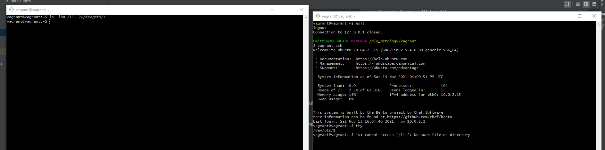
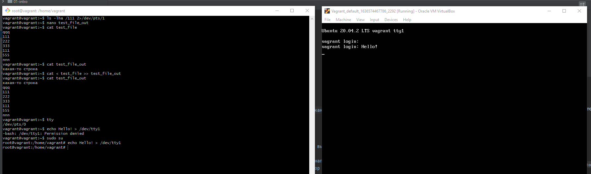

# **Домашняя работа к занятию «3.2. Работа в терминале, лекция 2»**
## _Задача №1_
**Какого типа команда `cd`? Попробуйте объяснить, почему она именно такого типа; опишите ход своих мыслей, если считаете что она могла бы быть другого типа.**

- `cd` - это встроенная в оболочку команда.
- Данная команда меняет у вызываемого его процесса атрибут - текущую рабочую директорию, если бы она была не встроенная, то порождалась как внешний процесс и наследовала бы атрибуты вызываемого процесса (например интерпретатора bash), которые по сути ей не нужны и пыталась изменить данный атрибут у родительского процесса.

## _Задача №2_
**Какая альтернатива без pipe команде `grep <some_string> <some_file> | wc -l`? `man grep` поможет в ответе на этот вопрос. Ознакомьтесь с документом о других подобных некорректных вариантах использования pipe.**

Представленная команда должна вернуть количество строк <some_string> в файле <some_file>. Альтернативным вариантом будет использование утилиты `grep` c параметром `-c`, например так:
```
vagrant@vagrant:~$ nano test_file
vagrant@vagrant:~$ grep -c 111 test_file
2
vagrant@vagrant:~$ cat test_file
qqq
111
222
333
111
555
nnn
```

## _Задача №3_
**Какой процесс с PID `1` является родителем для всех процессов в вашей виртуальной машине Ubuntu 20.04?**

- согласно `pstree -p` родителем является процесс **systemd**
- `cat /proc/1/cmdline` указывает на запуск команды **init**, что не является противоречием, т.к. **systemd** - это одна из новейших реализаций команды **init**.


## _Задача №4_
**Как будет выглядеть команда, которая перенаправит вывод stderr `ls` на другую сессию терминала?**

Команда будет выглядеть так: `ls -lha /111 2>/dev/pts/1`
```
vagrant@vagrant:/dev/pts$ who
vagrant  pts/0        2021-11-12 10:58 (10.0.2.2)
vagrant  pts/1        2021-11-12 12:32 (10.0.2.2)
vagrant@vagrant:/dev/pts$ ls -lha /111 2>/dev/pts/1
vagrant@vagrant:/dev/pts$
```
Вывод в терминале pts/1: 
```
vagrant@vagrant:~$ ls: cannot access '/111': No such file or directory
```
**скрин:**


## _Задача №5_
**Получится ли одновременно передать команде файл на stdin и вывести ее stdout в другой файл? Приведите работающий пример.**

Да, получится: `cat < test_file >> test_file_out`
```
vagrant@vagrant:~$ cat test_file
qqq
111
222
333
111
555
nnn
vagrant@vagrant:~$ cat test_file_out
какая-то строка
vagrant@vagrant:~$ cat < test_file >> test_file_out
vagrant@vagrant:~$ cat test_file_out
какая-то строка
qqq
111
222
333
111
555
nnn
```

## _Задача №6_
**Получится ли вывести находясь в графическом режиме данные из PTY в какой-либо из эмуляторов TTY? Сможете ли вы наблюдать выводимые данные?**

Получилось из-под root:
`root@vagrant:/home/vagrant# echo Hello! > /dev/tty1`

**скрин:**


## _Задача №7_
**Выполните команду `bash 5>&1`. К чему она приведет? Что будет, если вы выполните `echo netology > /proc/$$/fd/5`? Почему так происходит?**

- `bash 5>&1` создаст в текущей сессии файловый дескриптор `5` и перенаправит его в stdout
- `echo netology > /proc/$$/fd/5` выведет слово "netology" в дескриптор `5` и соответственно в stdout, т.к. `5` файловый дескриптор bash указывает на стандартный поток вывода.
```
vagrant@vagrant:~$ bash 5>&1
vagrant@vagrant:~$ echo netology > /proc/$$/fd/5
netology
```

## _Задача №8_
**Получится ли в качестве входного потока для pipe использовать только stderr команды, не потеряв при этом отображение stdout на pty? Напоминаем: по умолчанию через pipe передается только stdout команды слева от `|` на stdin команды справа. Это можно сделать, поменяв стандартные потоки местами через промежуточный новый дескриптор, который вы научились создавать в предыдущем вопросе.**
```
vagrant@vagrant:~$ ls -l /no_dir 7>&2 2>&1 1>&7 | grep "No such file or directory" -o
No such file or directory
```

## _Задача №9_
**Что выведет команда `cat /proc/$$/environ`? Как еще можно получить аналогичный по содержанию вывод?**

Команда выведет текущие переменные окружения с их значениями. Аналогичный вывод, только с разделением по строкам, даст вызов команд `printenv`, `env`.

## _Задача №10_
**Используя man, опишите что доступно по адресам `/proc/<PID>/cmdline`, `/proc/<PID>/exe`.**

`/proc/<PID>/cmdline` - доступный только для чтения файл, содержит полную командную строку запуска процесса, если только процесс не является зомби. Описывается на строках 215-219 `man proc`

`/proc/<PID>/exe` - содержит символьную ссылку на исполняемый файл процесса. Описывается на строках 266-285 `man proc`

## _Задача №11_
**Узнайте, какую наиболее старшую версию набора инструкций SSE поддерживает ваш процессор с помощью `/proc/cpuinfo`.**

- наиболее старшая версия SSE, поддерживаемая моим процессором - 4_2:

```
vagrant@vagrant:~$ cat /proc/cpuinfo | xargs -n 1 | grep sse | sort -u
sse
sse2
sse4_1
sse4_2
ssse3
```
## _Задача №12_
**При открытии нового окна терминала и `vagrant ssh` создается новая сессия и выделяется pty. Это можно подтвердить командой `tty`, которая упоминалась в лекции 3.2. Однако:**

```
vagrant@netology1:~$ ssh localhost 'tty'
not a tty
```
**Почитайте, почему так происходит, и как изменить поведение.**

В `man ssh` в строке 21 сказано, что если мы задаём команду (в нашем случае `tty`), она будет выполнена на удаленном хосте, а не в оболочке входа в систему. Чтобы создать псевдотерминал, надо использовать ключ -t (описывается на строках 315-317). 

## _Задача №13_
**Бывает, что есть необходимость переместить запущенный процесс из одной сессии в другую. Попробуйте сделать это, воспользовавшись `reptyr`. Например, так можно перенести в `screen` процесс, который вы запустили по ошибке в обычной SSH-сессии.**

При первом запуске `reptyr` в `screen` появилась ошибка с рекомендацией ознакомиться с настройками в файле `/etc/sysctl.d/10-ptrace.conf`
```
vagrant@vagrant:~$ reptyr 1555
Unable to attach to pid 1555: Operation not permitted
The kernel denied permission while attaching. If your uid matches
the target's, check the value of /proc/sys/kernel/yama/ptrace_scope.
For more information, see /etc/sysctl.d/10-ptrace.conf
```    
Насколько я понял, это ограничение ядра и изменять его рекомендуется только при работе в режиме отладки.
Я изменил значение файла `/proc/sys/kernel/yama/ptrace_scope` на `0`, после чего процесс удачно переместился в `screen`.

## _Задача №14_
**`sudo echo string > /root/new_file` не даст выполнить перенаправление под обычным пользователем, так как перенаправлением занимается процесс shell'а, который запущен без sudo под вашим пользователем. Для решения данной проблемы можно использовать конструкцию `echo string | sudo tee /root/new_file`. Узнайте что делает команда `tee` и почему в отличие от `sudo echo` команда с `sudo tee` будет работать.**

Команда `tee` читает из стандартного ввода и записывает как в стандартный вывод, так и в один или несколько файлов одновременно. `tee` в основном используется в сочетании с другими командами через pipe.

`echo string | sudo tee /root/new_file` - здесь `tee` получит на вход перенаправленный через pipe вывод команды echo, повысит разрешения до sudo и запишет в файл.


