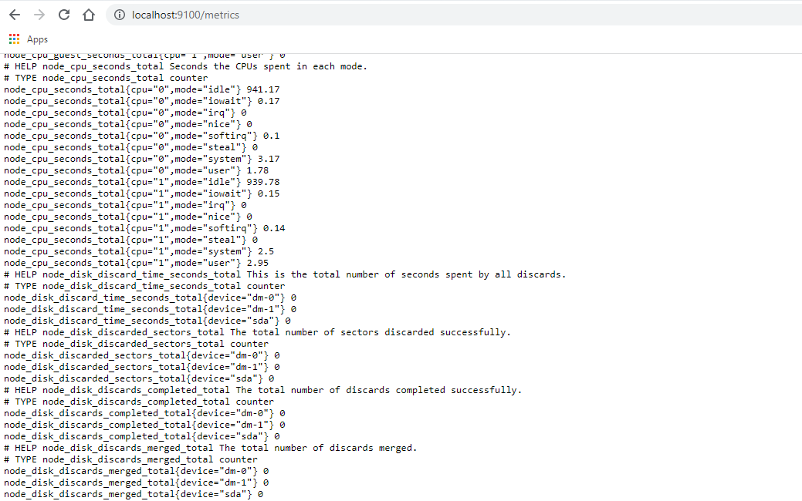
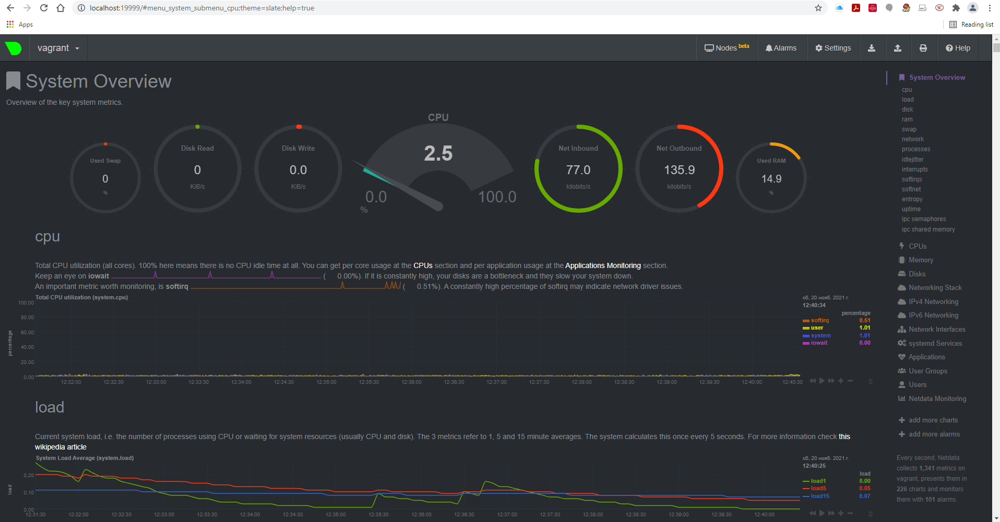
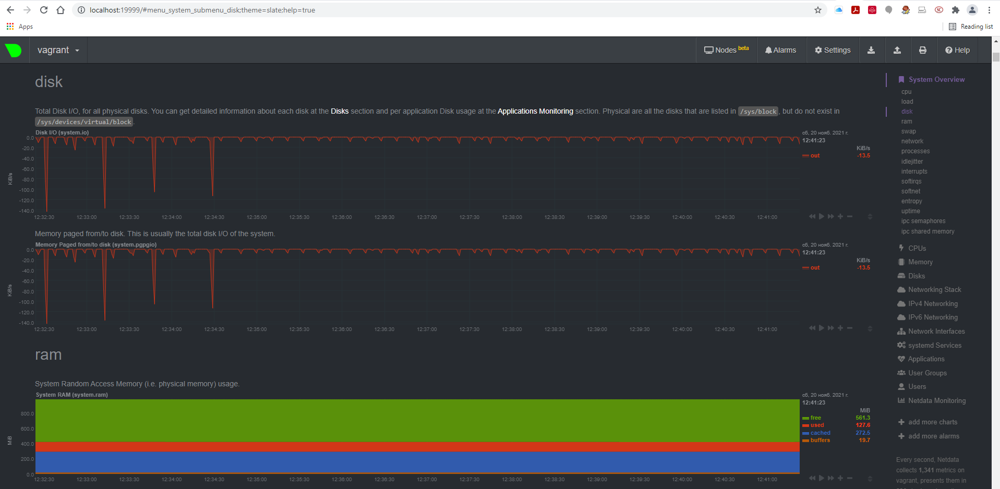
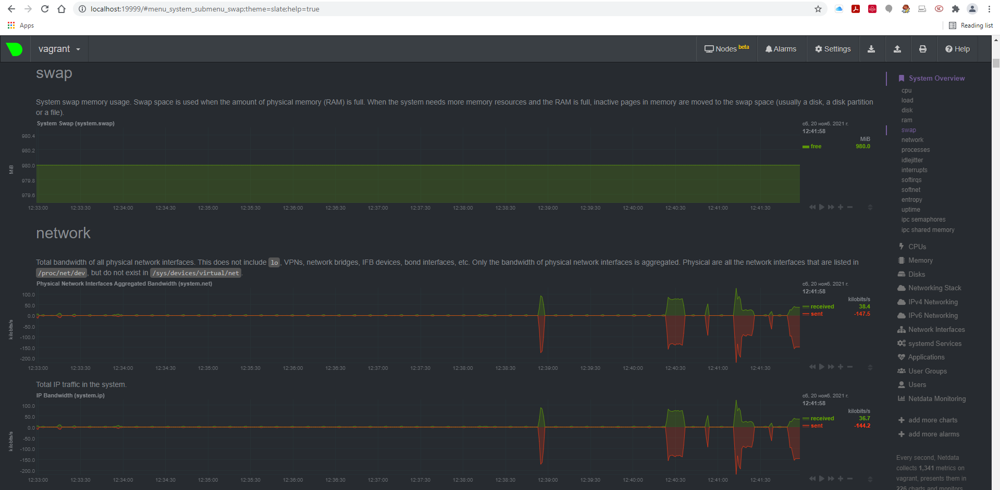
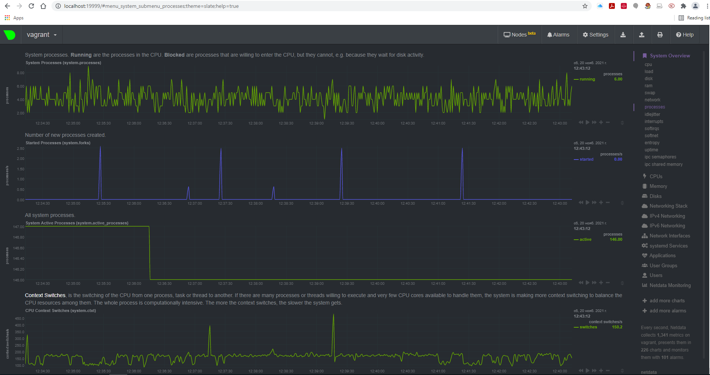

# **Домашняя работа к занятию «3.4. Операционные системы, лекция 2»**
## _Задача №1_
**На лекции мы познакомились с node_exporter. В демонстрации его исполняемый файл запускался в background. Этого достаточно для демо, но не для настоящей production-системы, где процессы должны находиться под внешним управлением. Используя знания из лекции по systemd, создайте самостоятельно простой unit-файл для node_exporter:**

- **поместите его в автозагрузку,**
- **предусмотрите возможность добавления опций к запускаемому процессу через внешний файл (посмотрите, например, на `systemctl cat cron`),**
- **удостоверьтесь, что с помощью systemctl процесс корректно стартует, завершается, а после перезагрузки автоматически поднимается.**

1. Загрузил последнюю версию с Github, распаковал, скопировал в место установки, создал пользователя, от имени которого будет запускаться node_exporter:
```
vagrant@vagrant:~$ wget https://github.com/prometheus/node_exporter/releases/download/v1.3.0/node_exporter-1.3.0.linux-amd64.tar.gz
...
vagrant@vagrant:~$ tar -xvf node_exporter-1.3.0.linux-amd64.tar.gz
vagrant@vagrant:~$ cp node_exporter-1.3.0.linux-amd64/node_exporter /usr/local/bin
vagrant@vagrant:~$ sudo useradd --no-create-home --shell /bin/false node_exporter
```
2. Создал unit-файл:
```vagrant@vagrant:~$ sudo systemctl edit --full --force node_exporter.service
vagrant@vagrant:~$ cat /etc/systemd/system/node_exporter.service
[Unit]
Description=Node Exporter
Wants=network-online.target
After=network-online.target
[Service]
User=node_exporter
Group=node_exporter
Type=simple
EnvironmentFile=/etc/default/node_exporter
ExecStart=/usr/local/bin/node_exporter
[Install]
WantedBy=multi-user.target
```
Во внешний файл опций не добавлял, оставил там закомментированный текст:
```
vagrant@vagrant:~$ cat /etc/default/node_exporter
# Please add custom options for node_exporter using
# $ systemctl edit node_exporter.service
# or
# $ systemctl edit --full node_exporter.service
```

3. Проверил создание сервиса, добавил в автозагрузку, запустил, остановил:
```
vagrant@vagrant:~$ sudo systemctl status node_exporter
● node_exporter.service - Node Exporter
     Loaded: loaded (/etc/systemd/system/node_exporter.service; disabled; vendor preset: enabled)
     Active: inactive (dead)
vagrant@vagrant:~$ sudo systemctl is-enabled node_exporter
disabled
vagrant@vagrant:~$ sudo systemctl enable node_exporter
Created symlink /etc/systemd/system/multi-user.target.wants/node_exporter.service → /etc/systemd/system/node_exporter.service.
vagrant@vagrant:~$ sudo systemctl is-enabled node_exporter
enabled
vagrant@vagrant:~$ sudo systemctl start node_exporter
vagrant@vagrant:~$ sudo systemctl status node_exporter
● node_exporter.service - Node Exporter
     Loaded: loaded (/etc/systemd/system/node_exporter.service; enabled; vendor preset: enabled)
     Active: active (running) since Sat 2021-11-20 07:42:41 UTC; 3s ago
   Main PID: 1324 (node_exporter)
      Tasks: 4 (limit: 1071)
     Memory: 2.3M
     CGroup: /system.slice/node_exporter.service
             └─1324 /usr/local/bin/node_exporter

Nov 20 07:42:41 vagrant node_exporter[1324]: ts=2021-11-20T07:42:41.038Z caller=node_exporter.go:115 level=info collector=thermal_zone
Nov 20 07:42:41 vagrant node_exporter[1324]: ts=2021-11-20T07:42:41.038Z caller=node_exporter.go:115 level=info collector=time
Nov 20 07:42:41 vagrant node_exporter[1324]: ts=2021-11-20T07:42:41.038Z caller=node_exporter.go:115 level=info collector=timex
Nov 20 07:42:41 vagrant node_exporter[1324]: ts=2021-11-20T07:42:41.038Z caller=node_exporter.go:115 level=info collector=udp_queues
Nov 20 07:42:41 vagrant node_exporter[1324]: ts=2021-11-20T07:42:41.038Z caller=node_exporter.go:115 level=info collector=uname
Nov 20 07:42:41 vagrant node_exporter[1324]: ts=2021-11-20T07:42:41.038Z caller=node_exporter.go:115 level=info collector=vmstat
Nov 20 07:42:41 vagrant node_exporter[1324]: ts=2021-11-20T07:42:41.038Z caller=node_exporter.go:115 level=info collector=xfs
Nov 20 07:42:41 vagrant node_exporter[1324]: ts=2021-11-20T07:42:41.038Z caller=node_exporter.go:115 level=info collector=zfs
Nov 20 07:42:41 vagrant node_exporter[1324]: ts=2021-11-20T07:42:41.038Z caller=node_exporter.go:199 level=info msg="Listening on" address=:9100
Nov 20 07:42:41 vagrant node_exporter[1324]: ts=2021-11-20T07:42:41.038Z caller=tls_config.go:195 level=info msg="TLS is disabled." http2=false
vagrant@vagrant:~$ sudo cat /proc/1324/environ
LANG=en_US.UTF-8LANGUAGE=en_US:PATH=/usr/local/sbin:/usr/local/bin:/usr/sbin:/usr/bin:/sbin:/bin:/snap/binHOME=/home/node_exporterLOGNAME=node_exporterUSER=node_exporterINVOCATION_ID=a78a8da427f2416c9226db2d699f7fc1JOURNAL_STREAM=9:31779
vagrant@vagrant:~$ sudo systemctl stop node_exporter
vagrant@vagrant:~$ sudo shutdown -r now
```
4. Проверил автостарт после перезагрузки системы:
```
vagrant@vagrant:~$ ps aux | grep node_exporter
node_ex+     784  0.0  1.0 715708 10836 ?        Ssl  07:45   0:00 /usr/local/bin/node_exporter
vagrant      887  0.0  0.0   9032   740 pts/0    S+   07:47   0:00 grep --color=auto node_exporter
vagrant@vagrant:~$ sudo systemctl status node_exporter
● node_exporter.service - Node Exporter
     Loaded: loaded (/etc/systemd/system/node_exporter.service; enabled; vendor preset: enabled)
     Active: active (running) since Sat 2021-11-20 07:45:59 UTC; 1min 8s ago
   Main PID: 784 (node_exporter)
      Tasks: 5 (limit: 1071)
     Memory: 13.1M
     CGroup: /system.slice/node_exporter.service
             └─784 /usr/local/bin/node_exporter

Nov 20 07:45:59 vagrant node_exporter[784]: ts=2021-11-20T07:45:59.569Z caller=node_exporter.go:115 level=info collector=thermal_zone
Nov 20 07:45:59 vagrant node_exporter[784]: ts=2021-11-20T07:45:59.569Z caller=node_exporter.go:115 level=info collector=time
Nov 20 07:45:59 vagrant node_exporter[784]: ts=2021-11-20T07:45:59.569Z caller=node_exporter.go:115 level=info collector=timex
Nov 20 07:45:59 vagrant node_exporter[784]: ts=2021-11-20T07:45:59.569Z caller=node_exporter.go:115 level=info collector=udp_queues
Nov 20 07:45:59 vagrant node_exporter[784]: ts=2021-11-20T07:45:59.569Z caller=node_exporter.go:115 level=info collector=uname
Nov 20 07:45:59 vagrant node_exporter[784]: ts=2021-11-20T07:45:59.569Z caller=node_exporter.go:115 level=info collector=vmstat
Nov 20 07:45:59 vagrant node_exporter[784]: ts=2021-11-20T07:45:59.569Z caller=node_exporter.go:115 level=info collector=xfs
Nov 20 07:45:59 vagrant node_exporter[784]: ts=2021-11-20T07:45:59.569Z caller=node_exporter.go:115 level=info collector=zfs
Nov 20 07:45:59 vagrant node_exporter[784]: ts=2021-11-20T07:45:59.572Z caller=node_exporter.go:199 level=info msg="Listening on" address=:9100
Nov 20 07:45:59 vagrant node_exporter[784]: ts=2021-11-20T07:45:59.573Z caller=tls_config.go:195 level=info msg="TLS is disabled." http2=false
```

**Дополнение:**

Дополнительные опции в службу могут быть переданы несколькими способами:

1. директивой `Environment=` задаются необходимые переменные среды, согласно синтаксису systemd.syntax. Эта директива может быть указана более одного раза, и в этом случае будут установлены все перечисленные переменные. Если одна и та же переменная указана дважды, более поздняя настройка переопределит более раннюю настройку. Если директиве присвоена пустая строка, список переменных среды сбрасывается, все предыдущие назначения не действуют.

Например:
`Environment="VAR1=word1 word2" VAR2=word3 "VAR3=$word 5 6"`
задаст три переменные "VAR1", "VAR2", "VAR3" со значениями "word1 word2", "word3", "$word 5 6".

2. директивой `EnvironmentFile=`, подобно первой директиве, но считывает перменные среды из текстового файла, как в нашей задаче. Каждая новая переменная должна начинаться с новой строки. Пустые строки, строки без `=`-разделителя или строки, начинающиеся с `;` или `#` будут проигнорированы, что может быть использовано для комментирования. Строка, оканчивающаяся обратным слэшем, будет объединена со следующей, что позволяет определять многострочные переменные. Анализатор удаляет начальные и конечные пробелы из значений присваиваний, если не используютя двойные кавычки.
Настройки из этих файлов имеют приоритет над настройками, сделанными с помощью Environment=. Если одна и та же переменная установлена дважды из этих файлов, файлы будут прочитаны в том порядке, в котором они указаны, и более поздняя настройка переопределит более раннюю настройку.

3. также пожно передать опции в командной строке, используя директиву `ExecStart=`

Например:
`ExecStart=/usr/local/bin/node_exporter -C /etc/default/node_exporter.conf`
или
`ExecStart=/bin/bash -c 'v=%i; USE_GPU=$${v%:*} exec /usr/local/bin/node_exporter'`


## _Задача №2_
**Ознакомьтесь с опциями node_exporter и выводом `/metrics` по-умолчанию. Приведите несколько опций, которые вы бы выбрали для базового мониторинга хоста по CPU, памяти, диску и сети.**

1. Пробросил порт 9100 на хостовую машину:
```
vagrant@vagrant:~$ sudo lsof -i :9100
COMMAND   PID          USER   FD   TYPE DEVICE SIZE/OFF NODE NAME
node_expo 785 node_exporter    3u  IPv6  23346      0t0  TCP *:9100 (LISTEN)
node_expo 785 node_exporter    7u  IPv6  30553      0t0  TCP vagrant:9100->_gateway:51303 (ESTABLISHED)
```




2. Опции для базового мониторинга хоста по CPU, памяти, диску и сети:
- Прцессор
```
node_cpu_seconds_total{cpu="0",mode="idle"} 941.17
node_cpu_seconds_total{cpu="0",mode="system"} 3.17
node_cpu_seconds_total{cpu="0",mode="user"} 1.78
node_cpu_seconds_total{cpu="1",mode="idle"} 939.78
node_cpu_seconds_total{cpu="1",mode="system"} 2.5
node_cpu_seconds_total{cpu="1",mode="user"} 2.95
```
- Память
```
node_memory_MemAvailable_bytes 7.76192e+08
node_memory_MemFree_bytes 6.6756608e+08
node_memory_MemTotal_bytes 1.028694016e+09
```
- Диски
```
node_disk_read_bytes_total{device="sda"} 2.46756352e+08
node_disk_read_time_seconds_total{device="sda"} 0.9470000000000001
node_disk_written_bytes_total{device="sda"} 8.48384e+06
node_disk_write_time_seconds_total{device="sda"} 0.804
node_disk_io_time_seconds_total{device="sda"} 3.028

```
- Сеть
```
node_network_receive_bytes_total{device="eth0"} 34732
node_network_receive_errs_total{device="eth0"} 0
node_network_transmit_bytes_total{device="eth0"} 51946
node_network_transmit_errs_total{device="eth0"} 0
```

## _Задача №3_
**Установите в свою виртуальную машину Netdata. Воспользуйтесь готовыми пакетами для установки (`sudo apt install -y netdata`). После успешной установки:**

- в конфигурационном файле `/etc/netdata/netdata.conf` в секции [web] замените значение с localhost на `bind to = 0.0.0.0`,
- добавьте в Vagrantfile проброс порта Netdata на свой локальный компьютер `config.vm.network "forwarded_port", guest: 19999, host: 19999` и сделайте `vagrant reload`:

**После успешной перезагрузки в браузере на своем ПК (не в виртуальной машине) вы должны суметь зайти на localhost:19999. Ознакомьтесь с метриками, которые по умолчанию собираются Netdata и с комментариями, которые даны к этим метрикам.**

1. Netdata установил, конфиги изменил, сделал `vagrant reload`:

```
vagrant@vagrant:~$ sudo lsof -i :19999
COMMAND PID    USER   FD   TYPE DEVICE SIZE/OFF NODE NAME
netdata 784 netdata    4u  IPv4  23460      0t0  TCP *:19999 (LISTEN)
netdata 784 netdata   21u  IPv4  30758      0t0  TCP vagrant:19999->_gateway:51292 (ESTABLISHED)
netdata 784 netdata   23u  IPv4  30760      0t0  TCP vagrant:19999->_gateway:51293 (ESTABLISHED)
netdata 784 netdata   25u  IPv4  30762      0t0  TCP vagrant:19999->_gateway:51294 (ESTABLISHED)
netdata 784 netdata   26u  IPv4  30548      0t0  TCP vagrant:19999->_gateway:51295 (ESTABLISHED)
netdata 784 netdata   27u  IPv4  30550      0t0  TCP vagrant:19999->_gateway:51296 (ESTABLISHED)
netdata 784 netdata   28u  IPv4  29264      0t0  TCP vagrant:19999->_gateway:51262 (ESTABLISHED)
```
2. Зашёл на хостовой машине на адрес http://localhost:19999/:










## _Задача №4_
**Можно ли по выводу `dmesg` понять, осознает ли ОС, что загружена не на настоящем оборудовании, а на системе виртуализации?**

Да, по выводу `dmesg` понятно, что ОС известно о своей загрузке на системе виртуализации:
```
vagrant@vagrant:~$ dmesg | grep virtual
[    0.001708] CPU MTRRs all blank - virtualized system.
[    0.100828] Booting paravirtualized kernel on KVM
[    2.419867] systemd[1]: Detected virtualization oracle.
```

## _Задача №5_
**Как настроен sysctl `fs.nr_open` на системе по-умолчанию? Узнайте, что означает этот параметр. Какой другой существующий лимит не позволит достичь такого числа (`ulimit --help`)?**

`fs.nr_open` определяет, сколько максимально может быть открыто файловых дескрипторов в системе:
```
vagrant@vagrant:~$ sudo sysctl -a | grep fs.nr_open
fs.nr_open = 1048576
```
- `ulimit -Sn` или `ulimit -n` - «мягкий» лимит для пользователя (но его можно изменить):
```
vagrant@vagrant:~$ ulimit -Sn
1024
```
- `ulimit -Hn` - «жёсткий» лимит для пользователя, не может превышать системный
```
vagrant@vagrant:~$ ulimit -Hn
1048576
```

## _Задача №6_
**Запустите любой долгоживущий процесс (не `ls`, который отработает мгновенно, а, например, `sleep 1h`) в отдельном неймспейсе процессов; покажите, что ваш процесс работает под PID 1 через `nsenter`. Для простоты работайте в данном задании под root (`sudo -i`). Под обычным пользователем требуются дополнительные опции (`--map-root-user`) и т.д.**

```
root@vagrant:/home/vagrant# unshare -f --pid --mount-proc sleep 1h

```
```
root@vagrant:/home/vagrant# lsns
        NS TYPE   NPROCS   PID USER            COMMAND
4026531835 cgroup    120     1 root            /sbin/init
4026531836 pid       119     1 root            /sbin/init
4026531837 user      120     1 root            /sbin/init
4026531838 uts       116     1 root            /sbin/init
4026531839 ipc       120     1 root            /sbin/init
4026531840 mnt       109     1 root            /sbin/init
4026531860 mnt         1    21 root            kdevtmpfs
4026531992 net       120     1 root            /sbin/init
4026532162 mnt         3   388 root            /lib/systemd/systemd-udevd
4026532163 uts         3   388 root            /lib/systemd/systemd-udevd
4026532164 mnt         1   404 systemd-network /lib/systemd/systemd-networkd
4026532183 mnt         1   555 systemd-resolve /lib/systemd/systemd-resolved
4026532184 mnt         2   932 root            unshare -f --pid --mount-proc sleep 1h
4026532185 pid         1   933 root            sleep 1h
4026532249 mnt         1   597 root            /usr/sbin/irqbalance --foreground
4026532250 mnt         1   611 root            /lib/systemd/systemd-logind
4026532251 uts         1   611 root            /lib/systemd/systemd-logind
4026532252 mnt         1   793 root            /usr/libexec/fwupd/fwupd
root@vagrant:/home/vagrant# nsenter --target 933 --pid --mount
root@vagrant:/# ps aux
USER         PID %CPU %MEM    VSZ   RSS TTY      STAT START   TIME COMMAND
root           1  0.0  0.0   8076   596 pts/0    S+   20:29   0:00 sleep 1h
root           2  0.0  0.3   9836  3972 pts/1    S    20:31   0:00 -bash
root          11  0.0  0.3  11492  3348 pts/1    R+   20:31   0:00 ps aux
```

## _Задача №7_
**Найдите информацию о том, что такое `:(){ :|:& };:`. Запустите эту команду в своей виртуальной машине Vagrant с Ubuntu 20.04 _(это важно, поведение в других ОС не проверялось)_. Некоторое время все будет "плохо", после чего (минуты) – ОС должна стабилизироваться. Вызов `dmesg` расскажет, какой механизм помог автоматической стабилизации. Как настроен этот механизм по-умолчанию, и как изменить число процессов, которое можно создать в сессии?**

`:(){ :|:& };:`- это последовательность команд, так называемая «fork-бомба», в которой функция вызывает себя дважды, каждая из вызванных функций вызывает себя дважды и так далее в геометрической прогрессии пока не кончатся ресурсы.

`[ 2901.442847] cgroup: fork rejected by pids controller in /user.slice/user-1000.slice/session-1.scope`

Помогло стабилизировать систему ограничение на максимальное число процессов в слайсе текущего пользователя с id 1000:

```
vagrant@vagrant:~$ cat /sys/fs/cgroup/pids/user.slice/user-1000.slice/pids.max
2356
```
Изменить это значение можно так:
```
vagrant@vagrant:~$ sudo systemctl set-property user-1000.slice TasksMax=2356
```


