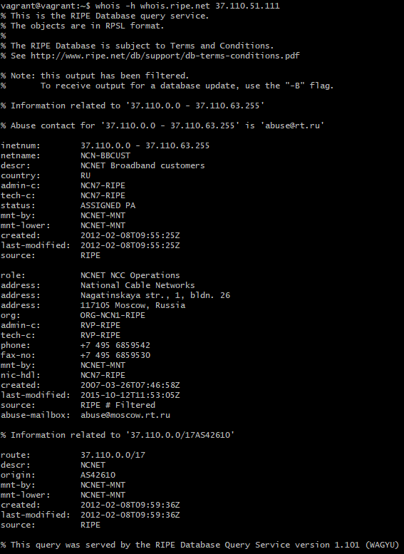

# **Домашняя работа к занятию «3.6. Компьютерные сети, лекция 1»**
## _Задача №1_
**Работа c HTTP через телнет.**

- Подключитесь утилитой телнет к сайту stackoverflow.com `telnet stackoverflow.com 80`
- Отправьте HTTP запрос:
```
GET /questions HTTP/1.0
HOST: stackoverflow.com
[press enter]
[press enter]
```
- В ответе укажите полученный HTTP код, что он означает?

результат HTTP-запроса:

запрос вернул HTTP-код 301 - Moved Permanently, т.е. запрошенный документ был окончательно перенесен на новый URI, указанный в поле `Location` заголовка, в нашем случае https://stackoverflow.com/questions


## _Задача №2_
**Повторите задание 1 в браузере, используя консоль разработчика F12.**

- откройте вкладку `Network`
- отправьте запрос http://stackoverflow.com
- найдите первый ответ HTTP сервера, откройте вкладку `Headers`
- укажите в ответе полученный HTTP код.
- проверьте время загрузки страницы, какой запрос обрабатывался дольше всего?
- приложите скриншот консоли браузера в ответ.

На первый ответ веб-сервера вернулся **код 200 - успешный запрос**:

Дольше всего, 328 ms, обрабатывался самый первый запрос:


## _Задача №3_
**Какой IP адрес у вас в интернете?**


## _Задача №4_
**Какому провайдеру принадлежит ваш IP адрес? Какой автономной системе AS? Воспользуйтесь утилитой `whois`.**

IP принадлежит провайдеру NCNET (National Cable Networks), автономная ситема AS42610:


## _Задача №5_
**Через какие сети проходит пакет, отправленный с вашего компьютера на адрес 8.8.8.8? Через какие AS? Воспользуйтесь утилитой `traceroute`.**

Пакет проходит через следующие сети и AS:


## _Задача №6_
**Повторите задание 5 в утилите `mtr`. На каком участке наибольшая задержка - delay?**

Наибольшая задержка на втором участке, видимо провайдера:


## _Задача №7_
**Какие DNS сервера отвечают за доменное имя dns.google? Какие A записи? Воспользуйтесь утилитой `dig`.**

- За доменное имя dns.google отвечают NS-серверы:
```
ns2.zdns.google.
ns4.zdns.google.
ns3.zdns.google.
ns1.zdns.google.
```


- А-записи для имени dns.google это IP-адреса 8.8.4.4 и 8.8.8.8:


## _Задача №8_
**Проверьте PTR записи для IP адресов из задания 7. Какое доменное имя привязано к IP? Воспользуйтесь утилитой `dig`.**

- Проверяем PTR запись для IP адреса 8.8.8.8:


к адресу привязано имя dns.google.


- Проверяем PTR запись для IP адреса 8.8.4.4:


к адресу также привязано имя dns.google.