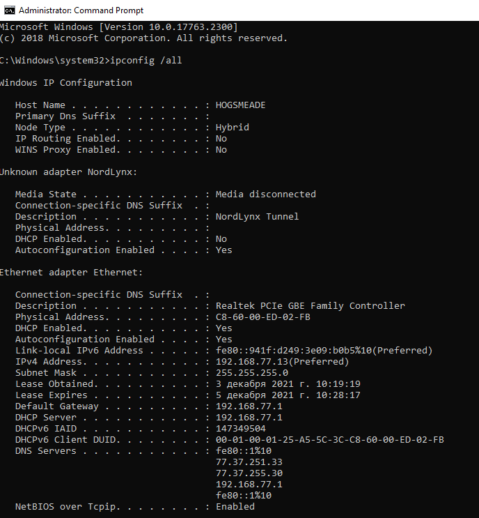
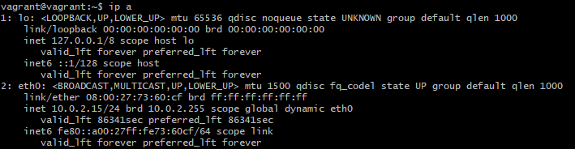
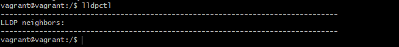
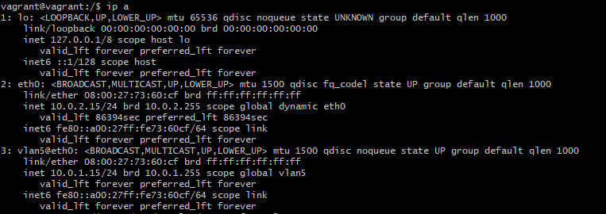
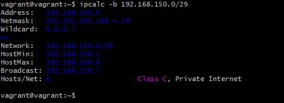
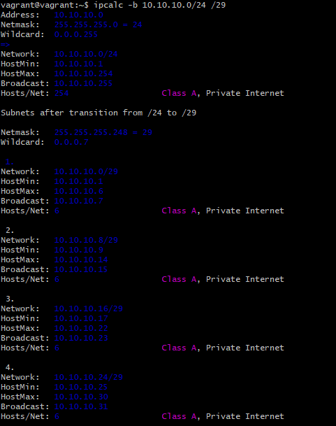
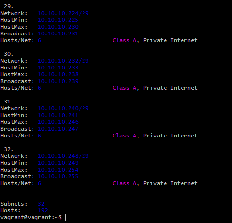
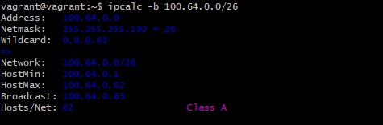
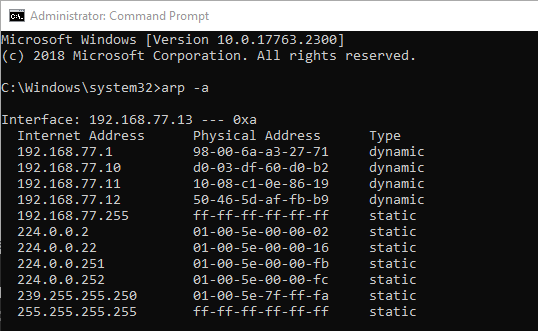
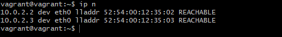

# **Домашнее работа к занятию «3.7. Компьютерные сети, лекция 2»**
## _Задача №1_
**Проверьте список доступных сетевых интерфейсов на вашем компьютере. Какие команды есть для этого в Linux и в Windows?**

- в Windows: `ipconfig`


- в Linux: `ip`, `ifconfig` (считается устаревшей)



## _Задача №2_
**Какой протокол используется для распознавания соседа по сетевому интерфейсу? Какой пакет и команды есть в Linux для этого?**

- Используется протокол LLDP. Link Layer Discovery Protocol (LLDP) - протокол канального уровня, позволяющий сетевому оборудованию оповещать оборудование, работающее в локальной сети, о своём существовании и передавать ему свои характеристики, а также получать от него аналогичные сведения.
- Пакет в Linux - `lldpd`
- Команда `lldpctl`




## _Задача №3_
**Какая технология используется для разделения L2 коммутатора на несколько виртуальных сетей? Какой пакет и команды есть в Linux для этого? Приведите пример конфига.**

- Для разделения L2 коммутатора на несколько виртуальных сетей используется технология VLAN.
- Пакеты такие: `vlan`, `vconfig`, `netplan`
- Пример конфига в `netplan`:
```
vagrant@vagrant:/$ cat /etc/netplan/01-netcfg.yaml
network:
  version: 2
  ethernets:
    eth0:
      dhcp4: true
  vlans:
        vlan5:
            id: 5
            link: eth0
            dhcp4: no
            addresses: [10.0.1.15/24]
            gateway4: 10.0.1.1
vagrant@vagrant:/$
```


## _Задача №4_
**Какие типы агрегации интерфейсов есть в Linux? Какие опции есть для балансировки нагрузки? Приведите пример конфига.**

В Linux для объединения нескольких сетевых интерфейсов в один используется **bonding**.

Режимы работы bonding:
- **mode=0 (balance-rr)**: пакеты отправляются "по кругу" от первого интерфейса к последнему и сначала. Если выходит из строя один из интерфейсов, пакеты отправляются на остальные оставшиеся, обеспечивает балансировку нагрузки и отказоустойчивость.
- **mode=1 (active-backup)**: один интерфейс работает в активном режиме, остальные в ожидающем. Если активный падает, управление передается одному из ожидающих.
- **mode=2 (balance-xor)**: интерфейс определяет, через интерфейс отправить пакеты, в зависимости от MAC-адресов источника и получателя, обеспечивает балансировку нагрузки и отказоустойчивость.
- **mode=3 (broadcast)**: происходит передача во все объединенные интерфейсы, обеспечивая отказоустойчивость.
- **mode=4 (802.3ad)**: это динамическое объединение портов. В данном режиме можно получить значительное увеличение пропускной способности как входящего так и исходящего трафика, используя все объединенные интерфейсы.
- **mode=5 (balance-tlb)**: адаптивная балансировка нагрузки. При balance-tlb входящий трафик получается только активным интерфейсом, исходящий - распределяется в зависимости от текущей загрузки каждого интерфейса. Обеспечивается отказоустойчивость и распределение нагрузки исходящего трафика.
- **mode=6 (balance-alb)**: адаптивная балансировка нагрузки (более совершенная). Обеспечивает балансировку нагрузки как исходящего (TLB, transmit load balancing), так и входящего трафика (для IPv4 через ARP). 

Пример конфигага при использовании **netplan**:
```
vagrant@vagrant:/$ cat /etc/netplan/01-netcfg.yaml
network:
  version: 2
  ethernets:
    eth0:
      dhcp4: true
    eth1:
      dhcp4: true  
  bonds:
    bond0:
      dhcp4: no
      interfaces: [eth0, eth1]
        parameters:
          mode: active-backup
        addresses: [10.0.2.15/24]
        gateway4: 10.0.2.1
```

## _Задача №5_
**Сколько IP адресов в сети с маской /29 ? Сколько /29 подсетей можно получить из сети с маской /24. Приведите несколько примеров /29 подсетей внутри сети 10.10.10.0/24.**

- в сети с маской /29 8 IP-адресов: хосты с .1 по .6, сама сеть .0 и широковещательный .7


- из сети с маской /24 можно получить 32 сети с маской /29, например для сети 10.10.10.0/24 получим такие варианты:



## _Задача №6_
**Задача: вас попросили организовать стык между 2-мя организациями. Диапазоны 10.0.0.0/8, 172.16.0.0/12, 192.168.0.0/16 уже заняты. Из какой подсети допустимо взять частные IP адреса? Маску выберите из расчета максимум 40-50 хостов внутри подсети.**

- Частные адреса можно взять из сети 100.64.0.0, маску возьмём /26:


## _Задача №7_
**Как проверить ARP таблицу в Linux, Windows? Как очистить ARP кеш полностью? Как из ARP таблицы удалить только один нужный IP?**

- проверить ARP таблицу в Windows **arp -a**:



- проверить ARP таблицу в Linux **ip neigh show** или **ip n**:



- очистить ARP кеш полностью:
```
ip neigh flush
```
- удалить все записи для определённого сетевого интерфейса:
```
ip neigh flush dev eth0
```
- удалять IP адреса по одному с помощью команды del:
```
ip neigh del dev eth0 10.0.2.15
```


