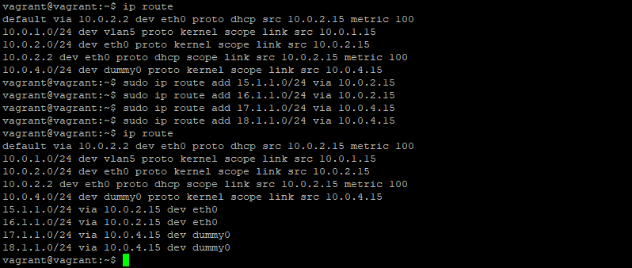

# **Домашняя работа к занятию «3.8. Компьютерные сети, лекция 3»**
## _Задача №1_
**Подключитесь к публичному маршрутизатору в интернет. Найдите маршрут к вашему публичному IP**

```
telnet route-views.routeviews.org
Username: rviews
show ip route x.x.x.x/32
show bgp x.x.x.x/32
```


## _Задача №2_
**Создайте dummy0 интерфейс в Ubuntu. Добавьте несколько статических маршрутов. Проверьте таблицу маршрутизации.**


Добавим несколько маршрутов и посмотрим таблицу маршрутизации:



## _Задача №3_
**Проверьте открытые TCP порты в Ubuntu, какие протоколы и приложения используют эти порты? Приведите несколько примеров.**

Смотрим TCP-порты и открывшие их приложения:

Открытые порты:

**111** - SUNRPC (rpcbind)

**53** - DNS (systemd-resolve)

**22** - SSH (sshd)

**9100** - node_exporter

**8125** - netdata

**19999** - netdata


## _Задача №4_
**Проверьте используемые UDP сокеты в Ubuntu, какие протоколы и приложения используют эти порты?**

Смотрим UDP-порты и открывшие их приложения:

Используемые UDP-сокеты:

**8125** - netdata

**53** - DNS (systemd-resolve)

**68** - DHCP (systemd-network)

**111** - SUNRPC (rpcbind)


## _Задача №5_
**Используя diagrams.net, создайте L3 диаграмму вашей домашней сети или любой другой сети, с которой вы работали.**

Фрагмент части сети компании, где я сейчас работаю:


