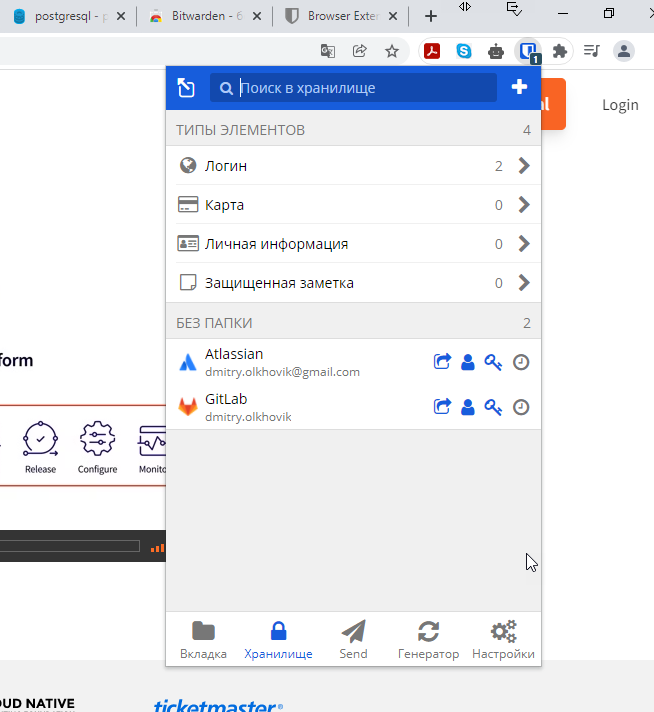
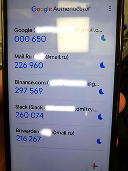
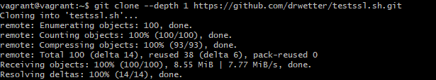
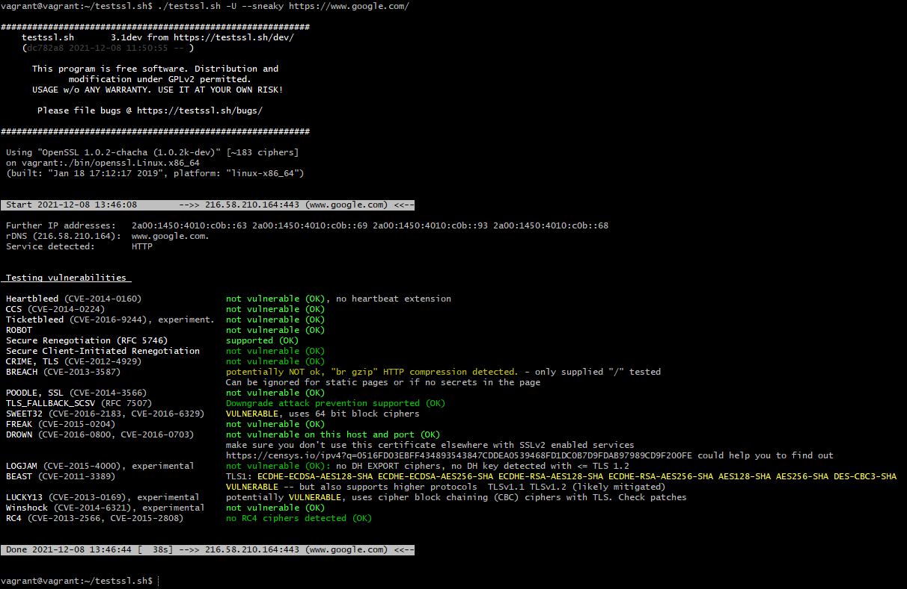
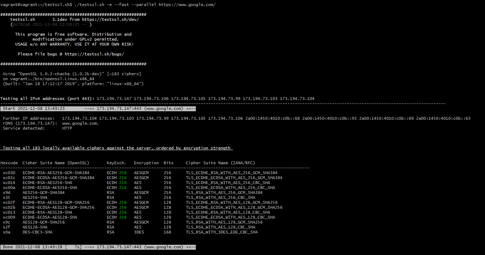
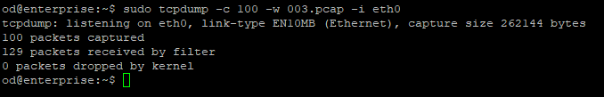
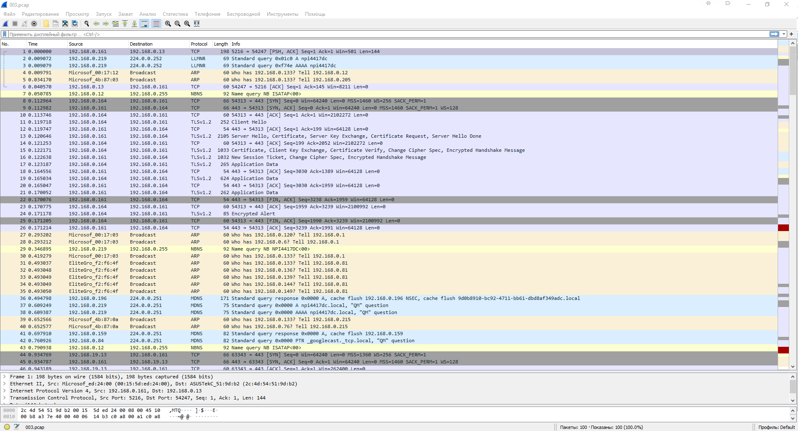

# **Домашнее работа к занятию «3.9. Элементы безопасности информационных систем»**
## _Задача №1_
**Установите Bitwarden плагин для браузера. Зарегестрируйтесь и сохраните несколько паролей.**

Выполнил:

## _Задача №2_
**Установите Google authenticator на мобильный телефон. Настройте вход в Bitwarden акаунт через Google authenticator OTP.**

Выполнил:

## _Задача №3_
**Установите apache2, сгенерируйте самоподписанный сертификат, настройте тестовый сайт для работы по HTTPS.**

## _Задача №4_
**Проверьте на TLS уязвимости произвольный сайт в интернете.**

Для теста скачал скрипт с github.com:

Первый тест:

Второй тест, для первого IP:

## _Задача №5_
**Установите на Ubuntu ssh сервер, сгенерируйте новый приватный ключ. Скопируйте свой публичный ключ на другой сервер. Подключитесь к серверу по SSH-ключу.**

## _Задача №6_
**Переименуйте файлы ключей из задания 5. Настройте файл конфигурации SSH клиента, так чтобы вход на удаленный сервер осуществлялся по имени сервера.**

## _Задача №7_
**Соберите дамп трафика утилитой tcpdump в формате pcap, 100 пакетов. Откройте файл pcap в Wireshark.**

запустил `tcpdump` на одной из машин в рабочей среде:

открыл файл 003.pcap в Wireshark:

