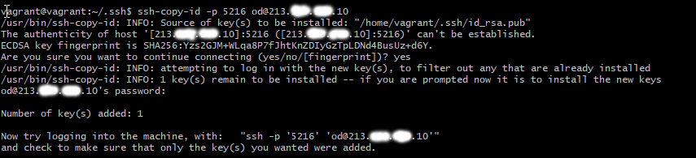
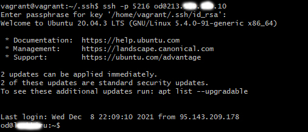
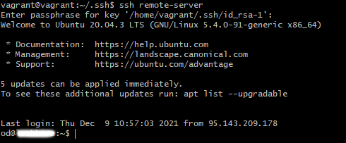

# **Домашнее работа к занятию «3.9. Элементы безопасности информационных систем»**
## _Задача №1_
**Установите Bitwarden плагин для браузера. Зарегестрируйтесь и сохраните несколько паролей.**

Выполнил:


## _Задача №2_
**Установите Google authenticator на мобильный телефон. Настройте вход в Bitwarden акаунт через Google authenticator OTP.**

Выполнил:


## _Задача №3_
**Установите apache2, сгенерируйте самоподписанный сертификат, настройте тестовый сайт для работы по HTTPS.**

- установил NGINX
- сгенерировал самоподписанный сертификат:


- добавил в конфиг по-умолчанию NGINX информацию о сертификате, активировал 443 ssl, и подкорректировал файл `/usr/share/nginx/html/index.html`:


- зашёл на сервер с хостовой машины:


## _Задача №4_
**Проверьте на TLS уязвимости произвольный сайт в интернете.**

Для теста скачал скрипт с github.com:


Первый тест:


Второй тест, для первого IP:


Файл второго теста полностью: https://github.com/olkhovik/sysadm/blob/main/03-sysadmin-9/image/test_google.com.log

## _Задача №5_
**Установите на Ubuntu ssh сервер, сгенерируйте новый приватный ключ. Скопируйте свой публичный ключ на другой сервер. Подключитесь к серверу по SSH-ключу.**

- генерируем новую пару ключей:


- копируем публичный ключ на удалённый сервер (использовал одну из машин на работе):



- подключаемся к удалённому серверу:




## _Задача №6_
**Переименуйте файлы ключей из задания 5. Настройте файл конфигурации SSH клиента, так чтобы вход на удаленный сервер осуществлялся по имени сервера.**

- добавляем в `/etc/ssh/ssh_config` строки:
```
host remote-server
hostname 213.xxx.xxx.10
IdentityFile ~/.ssh/id_rsa-1
user od
port 5216
``` 
и переименовываем файлы ключей:


- заходим на удалённый сервер по его имени:




## _Задача №7_
**Соберите дамп трафика утилитой tcpdump в формате pcap, 100 пакетов. Откройте файл pcap в Wireshark.**

запустил `tcpdump` на одной из машин в рабочей среде:


открыл файл 003.pcap в Wireshark:


