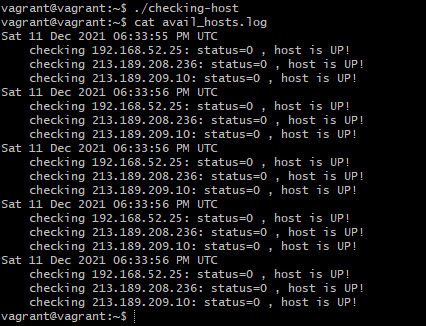
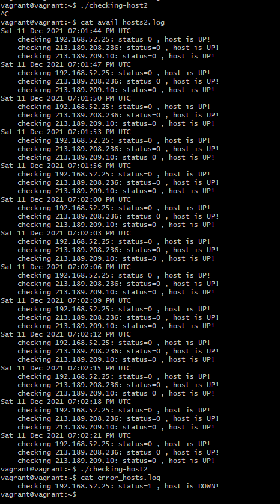

# **Домашнее работа к занятию «4.1. Командная оболочка Bash: Практические навыки»**
## _Задача №1_
**Есть скрипт:**
```
a=1
b=2
c=a+b
d=$a+$b
e=$(($a+$b))
```
**- Какие значения переменным c,d,e будут присвоены?**

**- Почему?**

- `c=a+b`, так как мы определили строку, не указав, что `a` и `b` переменные.
- `d=1+2`, получили строку, состоящую из значений переменных и между ними символом `+`
- `e=3`, здесь выполняется арифметическая операция со значениями переменных.

## _Задача №2_
**На нашем локальном сервере упал сервис и мы написали скрипт, который постоянно проверяет его доступность, записывая дату проверок до тех пор, пока сервис не станет доступным. В скрипте допущена ошибка, из-за которой выполнение не может завершиться, при этом место на Жёстком Диске постоянно уменьшается. Что необходимо сделать, чтобы его исправить:**

```
while ((1==1)
do
curl https://localhost:4757
if (($? != 0))
then
date >> curl.log
fi
done
```

- В первой строчке пропущена правая внешняя скобка.
- В начало скрипта лучше добавить информацию об использовании интерпретатора: `#!/usr/bin/env bash`
- Чтобы проверки были не слишком частыми, можно добавить `sleep`
- Для выхода из цикла нужно добавить проверку успешности

Новый вариант скрипта:
```
#!/usr/bin/env bash

while ((1==1))
do
  curl https://localhost:4757
  if (($? != 0))
  then
    date >> curl.log
  else exit
  fi
  sleep 3
done
```

## _Задача №3_
**Необходимо написать скрипт, который проверяет доступность трёх IP: 192.168.0.1, 173.194.222.113, 87.250.250.242 по 80 порту и записывает результат в файл log. Проверять доступность необходимо пять раз для каждого узла.**

Для проверки доступности IP выбрал адреса из рабочего окружения на работе:
```
#!/usr/bin/env bash

hosts=(192.168.52.25 213.189.208.236 213.189.209.10)
timeout=5
for i in {1..5}
do
date >>avail_hosts.log
  for h in ${hosts[@]}
  do
    curl -Is --connect-timeout $timeout $h:80 >/dev/null
      if (($? == 0))
        then
          echo "    checking" $h":" status=$? , host is UP! >>avail_hosts.log
        else
          echo "    checking" $h":" status=$? , host is DOWN! >>avail_hosts.log
       fi
  done
done
```
Результат работы скрипта:



## _Задача №4_
**Необходимо дописать скрипт из предыдущего задания так, чтобы он выполнялся до тех пор, пока один из узлов не окажется недоступным. Если любой из узлов недоступен - IP этого узла пишется в файл error, скрипт прерывается.**

```
#!/usr/bin/env bash

hosts=(192.168.52.25 213.189.208.236 213.189.209.10)
timeout=5
while true
do
  for i in {1..5}
  do
  date >>avail_hosts.log
    for h in ${hosts[@]}
    do
      curl -Is --connect-timeout $timeout $h:80 >/dev/null
        if (($? == 0))
          then
            echo "    checking" $h":" status=$? , host is UP! >>avail_hosts.log
          else
            echo "    checking" $h":" status=$? , host is DOWN! >>error_hosts.log
            break 3
        fi
    done
    sleep 3
  done
done
```

Результат работы скрипта:




